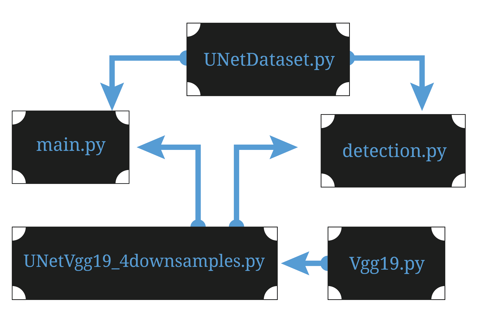

download the vgg19 weights from this link: https://www.kaggle.com/datasets/phuhung273/vgg19dcbb9e9dpth

The downloaded file should look something like **vgg19-dcbb9e9d.pth**
Place the file in the same directory as **UNetVgg19.py** (probably where this README.md is located)

## Execution

Each ecosystem created by LivePyxel has the same folder structure:

```
livepyxel/
├── config.json
├── images/
│   ├── img_000001.png
│   ├── img_000002.png
│   ...
├── masks/
│   ├── mask_000001.png
│   ├── mask_000002.png
│   ...

## How to Run main.py

Once you have the required files (`images/`, `masks/`, and `config.json`) created by LivePyxel and the VGG19 weights downloaded:

1. **Open a terminal** and navigate to this folder (`examples/UNetVgg19`).
2. **Ensure your Python environment is activated** and all dependencies are installed (see project root for environment setup).
3. **Run the main script** with the following command:

```powershell
python main.py --config config.json --images images --masks masks
```

Replace the paths if your files are located elsewhere. The script will use the configuration and data to train or evaluate the UNetVgg19 model.

### Arguments
- `--config`: Path to the configuration file (JSON format).
- `--images`: Directory containing input images.
- `--masks`: Directory containing corresponding mask images.


---

## Model Architecture

Below is a diagram illustrating the UNetVgg19 architecture:



**main.py**: Entry point for training or evaluating the UNetVgg19 model. Handles argument parsing, data loading, and workflow control. Run this script to begin training.

**UNetVgg19_4downsamples.py**: Defines the UNet architecture using VGG19 as the encoder, with four downsampling steps. Contains model building logic.

**Vgg19.py**: Loads and manages the VGG19 backbone, including weight initialization from the downloaded `.pth` file.

**UNetDataset.py**: Custom dataset class for loading images and masks, preprocessing, and batching for training/validation.

**detection.py**: Contains functions for running inference and post-processing on images using the trained model.


---

Once the model is trained, you can use the `detection.py` script to run inference on new images. This script will load the trained model and apply it to the images in the specified directory, saving the predicted masks.